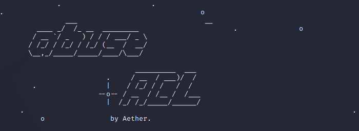
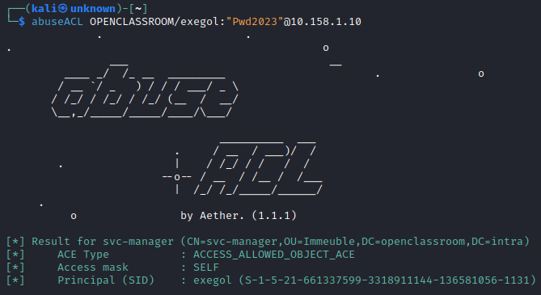
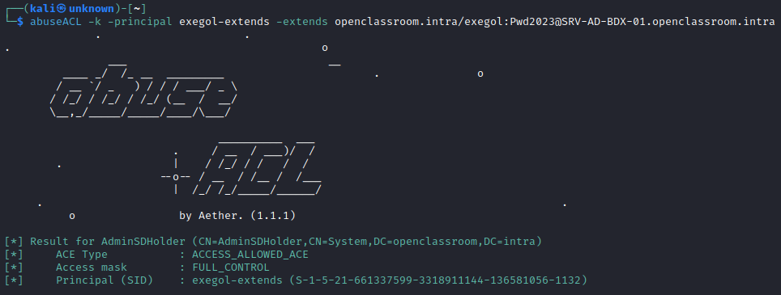
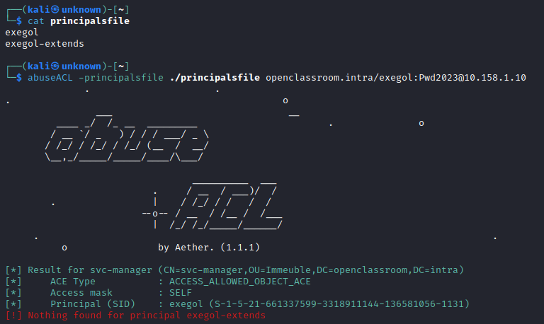
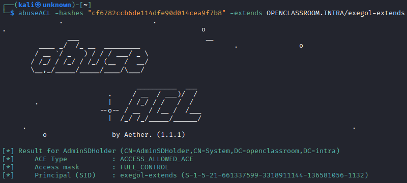

<p align="center">
    A python script to automatically list vulnerable Windows ACEs/ACLs.
    <br>
    
    
    <a href="https://twitter.com/intent/follow?screen_name=san__yohan" title="Follow"></a>
    <br>
</p>

## Installation

You can install it from pypi (latest version is ) with this command:

```bash
sudo python3 -m pip install abuseACL
```

OR from source :

```bash
git clone https://github.com/AetherBlack/abuseACL
cd abuseACL
sudo python3 -m pip install -r requirements.txt
sudo python3 setup.py install
```

OR with pipx :

```bash
python3 -m pipx install git+https://github.com/AetherBlack/abuseACL/
```

## Examples

- You want to list vulnerable ACEs/ACLs for the current user :

```bash
abuseACL $DOMAIN/$USER:"$PASSWORD"@$TARGET
```



- You want to list vulnerable ACEs/ACLs for another user/computer/group :

```bash
abuseACL -principal Aether $DOMAIN/$USER:"$PASSWORD"@$TARGET
```



- You want to list vulnerable ACEs/ACLs for a list of users/computers/groups :

```bash
abuseACL -principalsfile accounts.txt $DOMAIN/$USER:"$PASSWORD"@$TARGET
```

Here is an example of `principalsfile` content:

```
Administrateur
Group
aether
Machine$
```



- You want to list vulnerable ACEs/ACLs on Schema or on adminSDHolder :

```bash
abuseACL -extends $DOMAIN/$USER:"$PASSWORD"@$TARGET
```



You can look in the documentation of [DACL](https://www.thehacker.recipes/a-d/movement/dacl) to find out how to exploit the rights and use [dacledit](https://github.com/ThePorgs/impacket/blob/master/examples/dacledit.py) to exploit the ACEs.

## How it works

The tool will connect to the DC's LDAP to list users/groups/computers/OU/certificate templates and their nTSecurityDescriptor, which will be parsed to check for vulnerable rights.

---

## Credits

- [@_nwodtuhs](https://twitter.com/_nwodtuhs) for the helpful [DACL](https://www.thehacker.recipes/a-d/movement/dacl) documentation
- [@fortra](https://github.com/fortra/) for developping [impacket](https://github.com/fortra/impacket)

## License

[GNU General Public License v3.0](./LICENSE)
